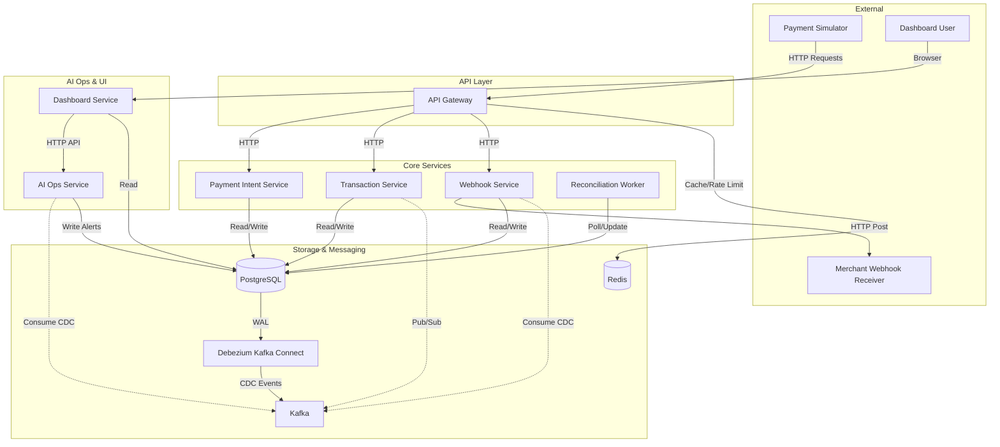

# Payment System (Stripe-like) - Production-Style Demo

This repository is a production-style payment processing system built for system design practice and as a deployable GitHub portfolio project.

## System Architecture



## Capabilities (in-scope)
- Create `PaymentIntent`
- Create `charge` `Transaction` for a `PaymentIntent`
- Poll payment status
- Webhooks (server-to-server) for status changes
- Merchant authentication via API key + HMAC request signing + nonce replay protection
- Durable audit trail via Postgres WAL -> Debezium CDC -> Kafka topics
- Agentic AI Ops (heuristic) monitoring + fraud-style alerting + intelligence reports
- Custom dashboard UI (no Grafana) to explore flows, alerts, and reports
- End-to-end traffic simulator to generate realistic local payment traffic

## Local Development
### Prereqs
- Docker Desktop

### Start
```bash
docker compose up --build
```

## Service URLs (local)

Gateway: http://localhost:3005

AI Ops API: http://localhost:6000

Dashboard UI: http://localhost:7000

### Demo merchant credentials
- `public_api_key`: `pk_demo_123`
- `secret_api_key`: `sk_demo_123`

## New: Agentic AI Ops + Dashboard + Simulator

This repo includes an **agentic (heuristic) AI ops workflow** that consumes CDC events from Kafka, computes risk snapshots, emits deduped fraud-style alerts, and periodically generates mock “intelligence reports”. A lightweight dashboard UI renders these insights.

### Data pipeline (CDC)

- **Source of truth**: Postgres
- **CDC**: Debezium (Kafka Connect) streams Postgres WAL changes into Kafka topics
- **Topics** (default):
  - `paymentdb.public.payment_intents`
  - `paymentdb.public.transactions`
  - `paymentdb.public.webhook_deliveries`

Connector registration is handled by the `debezium-init` compose service and is idempotent.

### DB migrations

Migrations are applied via the `db-migrate` service:

- `infra/db-migrate/migrations/003_ai_ops.sql`
  - Adds `fraud_alerts`
  - Adds `intelligence_reports`

### AI Ops Service (`ai-ops-service`)

Runs a Kafka consumer over CDC topics and maintains per-merchant rolling windows.

Key behaviors:

- Computes a demo-friendly risk score (0-100) using:
  - payment failure rate
  - transaction timeout rate
  - webhook failure rate
  - payment creation velocity
- Emits alerts into `fraud_alerts` with dedupe (one open alert per merchant/type per ~5 minutes)
- Generates mock intelligence reports into `intelligence_reports` on a timer

API endpoints (read/write):

- `GET /alerts?limit=...`
- `POST /alerts/:id/ack`
- `POST /alerts/:id/close`
- `GET /reports?limit=...`

Environment variables (compose defaults):

- `PORT` (default `6000`)
- `DATABASE_URL`
- `KAFKA_BROKERS` (default `kafka:29092` in compose)
- `AIOPS_WINDOW_MS` (rolling window)
- `AIOPS_REPORT_EVERY_MS` (report interval)
- `AIOPS_TOPICS` (comma-separated override)

### Dashboard Service (`dashboard-service`)

Fastify web UI that calls `ai-ops-service` and renders:

- Overview
- Alerts (table)
- Intelligence reports
- Flow explorer (joins `payment_intents` + `transactions` + `webhook_deliveries` by `payment_intent_id`)

Alert actions:

- Ack / Close buttons post back through the dashboard and proxy to `ai-ops-service`.

Environment variables:

- `PORT` (default `7000`)
- `DATABASE_URL`
- `AIOPS_URL` (default `http://ai-ops-service:6000` in compose)

### Payment Simulator (`payment-simulator`)

Generates realistic local traffic by creating payment intents + transactions through the API gateway.

Run:

```bash
docker compose run --rm payment-simulator
```

Environment variables (compose defaults):

- `GATEWAY_URL` (default `http://api-gateway:3000` inside the compose network)
- `MERCHANT_PUBLIC_KEY` (default `pk_demo_123`)
- `SIM_TOTAL` (default `50`)
- `SIM_CONCURRENCY` (default `5`)

The simulator uses the gateway’s dev signing helper endpoint (see below) to generate valid HMAC headers for each request.

### Dev signing helper

For local demo convenience the gateway exposes a dev-only signing endpoint:

- `POST /dev/sign`

This endpoint is disabled in production.

## Notes
- This project includes a **mock payment network** for local testing. Real card handling/tokenization is explicitly out of scope.

## Common local port overrides

If you have local port conflicts, override via environment variables:

- `API_GATEWAY_HOST_PORT` (default `3005`)
- `DASHBOARD_HOST_PORT` (default `7000`)
- `AIOPS_HOST_PORT` (default `6000`)
- `REDIS_HOST_PORT` (default `6380`)

## Quick Demo Script (end-to-end)

This is a copy/paste-friendly runthrough to demonstrate:

- Kafka CDC events (Debezium)
- Agentic AI Ops alerts + intelligence reports
- Dashboard UI
- Webhook retry behavior (optional)

### 1) Start the full stack

```bash
docker compose up -d --build
```

Wait until services are healthy/running:

```bash
docker compose ps
```

Expected:

- `postgres` is `healthy`
- `kafka`, `kafka-connect` are `Up`
- `debezium-init` exits successfully (connector already exists is OK)
- `ai-ops-service`, `dashboard-service`, `api-gateway` are `Up`

### 2) Open the dashboard

- Dashboard UI: http://localhost:7000
- AI Ops API: http://localhost:6000
- Gateway: http://localhost:3005

### 3) Generate traffic (simulator)

```bash
docker compose run --rm payment-simulator
```

Expected simulator output includes a summary similar to:

- `"byTx":{"succeeded":40,"timeout":5,"failed":5}`

### 4) View alerts and reports

In the dashboard:

- Go to `/alerts`
  - You should see new alerts (demo heuristic-based risk)
  - Click **Ack** or **Close** to update the alert status
- Go to `/reports`
  - You should see periodic intelligence reports (mock summaries)

Alternatively via API:

```bash
curl http://localhost:6000/alerts?limit=20
curl http://localhost:6000/reports?limit=5
```

### 5) (Optional) Webhook retry demo

The stack includes a local webhook receiver that intentionally fails the first N webhook calls to demonstrate retries.

Receiver:

- http://localhost:4000

You can change how many initial deliveries fail by setting:

- `WEBHOOK_RECEIVER_FAIL_FIRST_N` (default `2`)

Then re-run:

```bash
docker compose up -d --build webhook-receiver webhook-service
docker compose run --rm payment-simulator
```

Expected:

- `webhook-service` enqueues deliveries
- failed deliveries are retried with backoff until success or max attempts
